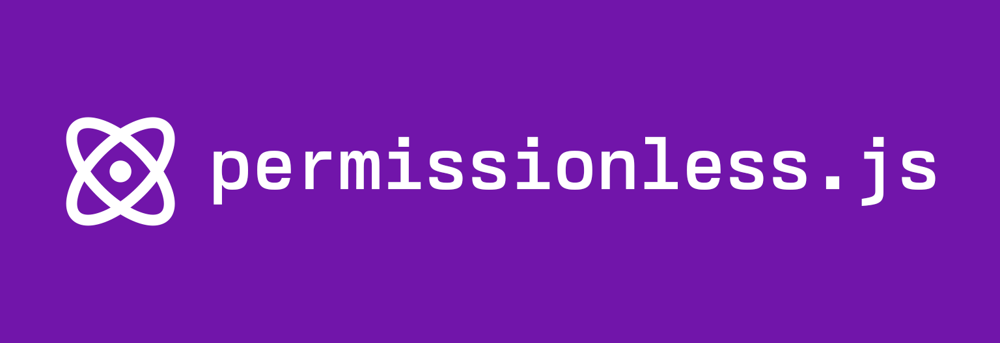

<p align="center"><a href="https://docs.pimlico/permissionless"></a></p>

# 🌸 Permissionless.js 🌸


Permissionless.js is a Typescript library built on top of [viem](https://viem.sh) for interacting with [ERC-4337 bundlers](https://eips.ethereum.org/EIPS/eip-4337) and paymasters.

## Getting started

For a full explanation of Permissionless.js, please visit our [docs page](https://docs.pimlico.io/)

Start using permissionless.js with:
```bash
bun install permissionless
./alto
```

## License

Distributed under an MIT License. See [LICENSE](./LICENSE) for more information.

## Contact

Feel free to ask any questions in our [Telegram group](https://t.me/pimlicoHQ)